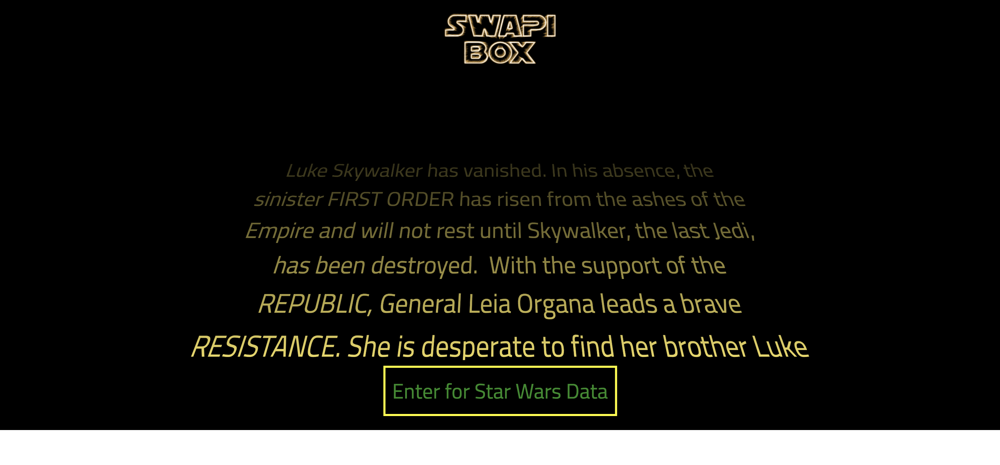
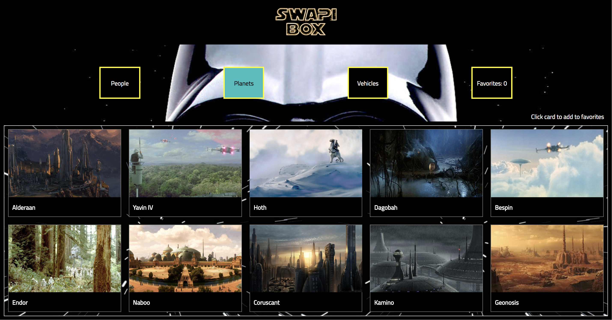
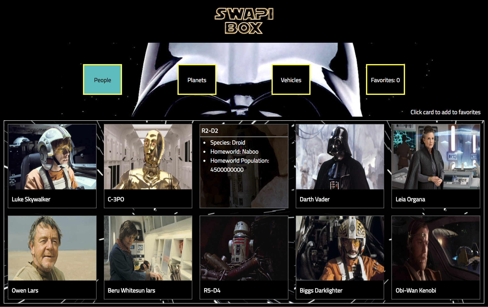
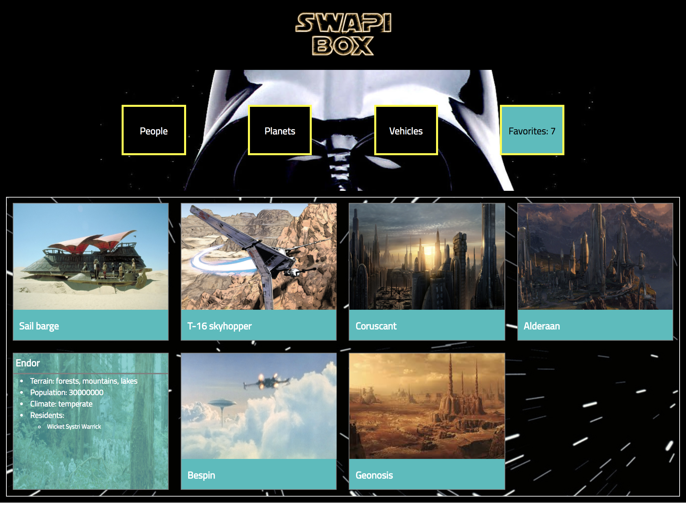

# SWAPIbox

## Overview 

SWAPIbox is an application that informs the user about Star Wars people, planets and vehicles. The user can choose which category to view and save individual cards to a favorites page. The application was made using React and React Router. The goal of this project was to practice building out React components, making API requests with async await, and testing React. This was an individual project during Module 3 at the Turing School of Software and Design. 

Set Up Instructions
```
npm install
npm start
```

Home Screen


Card Page Example


Hover to See More Information


Favorites Page

